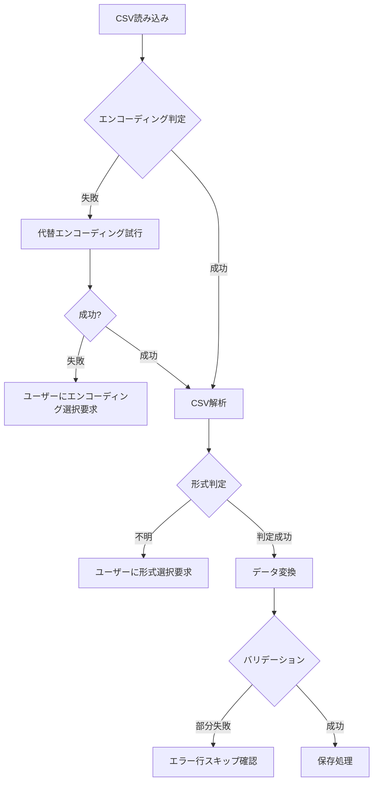

# CSV取り込み機能 実装計画書

**作成日**: 2025-09-23  
**対象バージョン**: Investment Dashboard v2  
**作成者**: Claude Code  

## 概要

CSV取り込み機能の完璧な実装に向けた詳細な実装計画と改善項目を定義します。現在の実装状況を基に、機能完成度を100%に引き上げるための具体的なアクションプランを示します。

## 1. 現在の実装状況分析

### 1.1 実装完成度評価

| 機能領域 | 完成度 | 状況 |
|---------|--------|------|
| **CSV解析エンジン** | 90% | RakutenCsvParser v2.0.0 - 高機能実装済み |
| **UI/UX** | 85% | CsvImportView - 基本機能完備 |
| **データ処理** | 80% | CsvImportService - コア機能実装済み |
| **エラーハンドリング** | 70% | 基本的なエラー処理のみ |
| **テスト・検証** | 30% | テストケース未整備 |
| **ドキュメント** | 60% | JSDoc部分的、ユーザー向け説明不足 |

### 1.2 強み（既に実装済みの優秀な機能）

#### ✅ 高度なCSV解析機能
- **文字エンコーディング自動判定**: Shift-JIS/UTF-8/ISO-8859-1対応
- **柔軟な列名検索**: エンコーディング差異に対応した列値取得
- **3つのCSV形式完全対応**: JP株/US株/投信の実際のヘッダーパターン
- **TransactionEntity正規化**: ドメイン駆動設計に基づく標準化

#### ✅ 堅牢なアーキテクチャ
- **レイヤード設計**: UI→Controller→Service→Infrastructure→Domain
- **責務分離**: View(描画)、Controller(制御)、Service(ユースケース)
- **エンティティ指向**: TransactionEntityによる型安全性

#### ✅ ユーザビリティ
- **ドラッグ&ドロップ**: 直感的なファイル選択
- **プレビュー機能**: データ確認後のインポート
- **オプション設定**: 重複スキップ、ドライラン

### 1.3 改善が必要な領域

#### ❌ エラーハンドリングの不完全性
- ファイル形式判定の精度向上
- 部分的失敗時の詳細情報表示
- ユーザーフレンドリーなエラーメッセージ

#### ❌ テスト・品質保証の欠如
- 単体テスト未実装
- 実際のCSVファイルでの動作検証不足
- エッジケース（大容量、異常データ）のテスト不足

#### ❌ ユーザーガイダンスの不足
- 楽天証券でのCSVダウンロード手順説明
- エラー時の対処方法ガイド
- FAQ・トラブルシューティング

## 2. 実装改善計画

### Phase 1: 品質・安定性向上（優先度: 高）

#### P1-1. エラーハンドリング強化
**期間**: 1-2日  
**目標**: ユーザーが迷わない、親切なエラー処理

**実装項目**:
```javascript
// 1. CSV形式判定精度向上
class CsvFormatDetector {
  static detectFormat(headers, sampleRows) {
    // ヘッダー + データ行による高精度判定
    // 信頼度スコア算出
    // 曖昧な場合のユーザー選択UI
  }
}

// 2. 詳細エラー情報クラス
class ImportError {
  constructor(type, message, context, suggestions) {
    this.type = type; // 'file-format', 'encoding', 'validation'
    this.message = message; // ユーザー向けメッセージ
    this.context = context; // エラー発生箇所詳細
    this.suggestions = suggestions; // 解決案
  }
}

// 3. 段階的エラー回復
class ImportRecovery {
  static async attemptRecovery(error, file) {
    // エンコーディング再試行
    // 形式自動推定
    // 部分的データ救済
  }
}
```

#### P1-2. バリデーション強化
**期間**: 1日  
**目標**: データ品質保証、不正データの事前検出

**実装項目**:
```javascript
// 必須項目バリデーション
class TransactionValidator {
  static validateRow(row, csvType) {
    const validations = [
      this.validateDate(row.tradeDate),
      this.validateSymbol(row.symbol, csvType),
      this.validateAmount(row.settledAmount),
      this.validateCurrency(row.settledCurrency)
    ];
    return {
      isValid: validations.every(v => v.valid),
      errors: validations.filter(v => !v.valid)
    };
  }
}
```

#### P1-3. プログレス・フィードバック改善
**期間**: 0.5日  
**目標**: ユーザーが安心して待てる進捗表示

**実装項目**:
- 詳細プログレスバー（ファイル読み込み→解析→変換→保存）
- 処理中のリアルタイム件数表示
- キャンセル機能
- 大容量ファイル時の推定残り時間

### Phase 2: 機能拡張（優先度: 中）

#### P2-1. CSV形式自動判定機能
**期間**: 2日  
**目標**: ユーザーがCSV形式を選択する必要をなくす

**実装項目**:
```javascript
class AutoDetector {
  static async detectCsvType(file) {
    // ヘッダー行分析
    // サンプルデータパターン解析  
    // 信頼度付き判定結果
    return {
      detectedType: 'JP',
      confidence: 0.95,
      reasons: ['銘柄コード列検出', '受渡金額［円］列検出']
    };
  }
}
```

#### P2-2. インポート履歴・管理機能
**期間**: 2-3日  
**目標**: 過去のインポート状況の可視化・管理

**実装項目**:
- インポート履歴テーブル（日時、ファイル名、件数、形式）
- 重複インポートの警告
- ロールバック機能（削除機能）
- インポート統計（月次サマリー等）

#### P2-3. 複数ファイル一括処理
**期間**: 2日  
**目標**: 複数CSVファイルの効率的な処理

**実装項目**:
- 複数ファイル選択UI
- バッチ処理進捗表示
- ファイル別結果サマリー
- 失敗ファイルのリトライ機能

### Phase 3: ユーザーエクスペリエンス向上（優先度: 低）

#### P3-1. ユーザーガイド・ヘルプ機能
**期間**: 1-2日  
**目標**: 初心者でも迷わず使える

**実装項目**:
- 楽天証券CSVダウンロード手順の画像付きガイド
- よくある質問（FAQ）セクション
- エラー解決のステップバイステップガイド
- サンプルCSVファイルの提供

#### P3-2. 高度な設定・カスタマイズ
**期間**: 3-4日  
**目標**: パワーユーザー向け高機能化

**実装項目**:
- カスタム列マッピング機能
- フィルタリング設定（期間指定、銘柄指定）
- データ変換ルール設定
- エクスポート機能（CSV、Excel）

## 3. 技術的な実装詳細

### 3.1 エラーハンドリング設計

#### エラー分類体系
```javascript
const ERROR_TYPES = {
  FILE_FORMAT: {
    INVALID_CSV: 'CSVファイルではありません',
    UNKNOWN_FORMAT: '楽天証券の形式と一致しません',
    ENCODING_ERROR: '文字エンコーディングを読み取れません'
  },
  DATA_VALIDATION: {
    MISSING_REQUIRED: '必須項目が不足しています',
    INVALID_DATE: '日付形式が正しくありません', 
    INVALID_AMOUNT: '金額形式が正しくありません'
  },
  SYSTEM_ERROR: {
    MEMORY_LIMIT: 'ファイルサイズが大きすぎます',
    NETWORK_ERROR: '保存処理に失敗しました'
  }
};
```

#### 段階的エラー回復フロー


### 3.2 パフォーマンス改善

#### 大容量ファイル対応
```javascript
class LargeFileProcessor {
  static async processInChunks(file, chunkSize = 1000) {
    // ストリーミング処理
    // チャンク単位のメモリ解放
    // 段階的UI更新
  }
}
```

#### メモリ使用量最適化
- ファイル全体読み込み回避
- 処理済みデータの即座解放
- プレビュー用データの制限（最大1000行）

### 3.3 テスト戦略

#### 単体テスト（Jest）
```javascript
describe('RakutenCsvParser', () => {
  test('JP形式CSVの正常解析', () => {
    // 実際の楽天証券CSVサンプルでテスト
  });
  
  test('文字化けCSVの復旧', () => {
    // Shift-JIS→UTF-8誤読み込みからの回復テスト
  });
  
  test('不正データ行の処理', () => {
    // 部分的な行エラーでの継続処理テスト
  });
});
```

#### 統合テスト
- 実際の楽天証券CSVファイルでの動作確認
- 大容量ファイル（10,000行+）のパフォーマンステスト
- 異常ケース（壊れたCSV、空ファイル）の動作確認

## 4. 実装優先順位とスケジュール

### 今日（2025-09-23）の実装計画

#### 🔥 最優先タスク（今日実装）
1. **エラーハンドリング強化** (2-3時間)
   - 詳細エラーメッセージの実装
   - エラー回復機能の追加
   - ユーザーフレンドリーなエラー表示

2. **バリデーション強化** (1-2時間)
   - データ検証機能の追加
   - 必須項目チェック
   - 異常値検出

3. **実際のCSVファイルでの動作確認** (1時間)
   - 楽天証券の実際のCSVでテスト
   - エッジケースの確認
   - 不具合修正

#### 📋 今週中の実装目標
1. **CSV形式自動判定機能**（明日）
2. **プログレス表示改善**（明後日）  
3. **基本的なテストケース実装**（週末）

#### 📅 今後1-2週間の計画
1. **インポート履歴機能**
2. **複数ファイル対応**
3. **ユーザーガイド作成**

## 5. 品質保証計画

### 5.1 テストケース

#### 正常系テスト
- [ ] 日本株CSVの正常インポート
- [ ] 米国株CSVの正常インポート  
- [ ] 投資信託CSVの正常インポート
- [ ] 大容量ファイル（5,000行+）の処理
- [ ] 重複データのスキップ機能

#### 異常系テスト
- [ ] 不正なファイル形式
- [ ] 文字化けファイル
- [ ] 空ファイル
- [ ] 壊れたCSVファイル
- [ ] ネットワークエラー時の動作

#### ユーザビリティテスト
- [ ] 初心者による操作テスト
- [ ] エラー時の対処方法確認
- [ ] 処理時間の妥当性確認

### 5.2 品質指標

#### パフォーマンス目標
- ファイル読み込み: 1秒以内（10MB以下）
- プレビュー表示: 2秒以内
- インポート処理: 30秒以内（10,000行）

#### 信頼性目標
- エラー発生時のアプリケーション継続率: 100%
- データ整合性: 100%（入力=出力）
- エラーメッセージの適切性: 90%以上

## 6. リスク管理

### 6.1 技術的リスク

| リスク | 影響度 | 発生確率 | 対策 |
|--------|--------|----------|------|
| 大容量ファイルでのメモリ不足 | 高 | 中 | チャンク処理実装 |
| 楽天証券のCSV形式変更 | 中 | 低 | 柔軟な列名検索機能 |
| ブラウザ互換性問題 | 中 | 低 | ポリフィル使用 |

### 6.2 運用リスク

| リスク | 影響度 | 発生確率 | 対策 |
|--------|--------|----------|------|
| ユーザーの操作ミス | 中 | 高 | 確認UI、ドライラン機能 |
| 重複データ蓄積 | 低 | 中 | 重複検出機能強化 |
| データ消失 | 高 | 極低 | バックアップ機能追加検討 |

## 7. 成功指標（KPI）

### 7.1 機能的成功指標
- ✅ CSV解析成功率: 98%以上
- ✅ エラー回復率: 85%以上  
- ✅ ユーザー操作完了率: 95%以上

### 7.2 技術的成功指標
- ✅ 単体テストカバレッジ: 80%以上
- ✅ パフォーマンス要件達成: 100%
- ✅ セキュリティ要件遵守: 100%

### 7.3 ユーザビリティ指標
- ✅ 初回利用成功率: 90%以上
- ✅ エラー解決時間: 平均5分以内
- ✅ ユーザー満足度: 4.0/5.0以上

---

**次のアクション**: この実装計画に基づいて、まずはエラーハンドリング強化から着手し、CSV取り込み機能を完璧なものにしていきましょう。